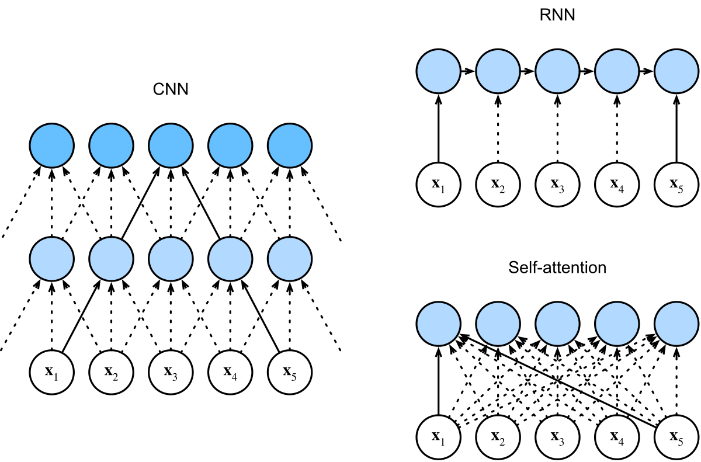
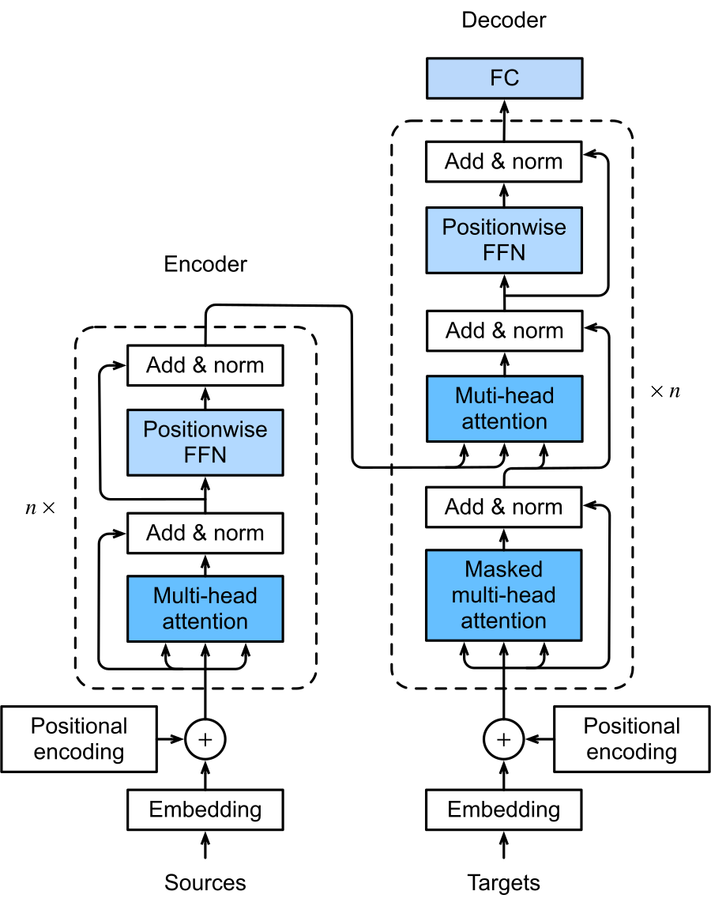

# Principles of LSTM, CNN & Transformer and Their Performance Comparison on Text Classification

**English** | [简体中文](README.zh-CN.md)

> A reproducible study comparing **BiLSTM**, **CNN**, and **Transformer** encoders on four
> text-classification benchmarks under a single, fair training protocol — paired with a
> from-first-principles theory deck (LSTM forward/backward derivations, CNN, attention,
> positional encoding, complexity analysis).

This repository has two parts:

- **`Code/`** — a clean PyTorch implementation (data pipeline, three models, unified trainer) plus the actual experimental outputs (metrics CSVs and training curves).
- **`Beamer/`** — the accompanying theory + results presentation (LaTeX/Beamer source and compiled PDF).

---

## Table of contents

- [Key results](#key-results)
- [What was compared](#what-was-compared)
- [Repository structure](#repository-structure)
- [Datasets](#datasets)
- [Setup](#setup)
- [Usage](#usage)
- [Method: unified training protocol](#method-unified-training-protocol)
- [Model architectures](#model-architectures)
- [Outputs](#outputs)
- [Conclusions](#conclusions)
- [Presentation / report](#presentation--report)
- [Notes & limitations](#notes--limitations)

---

## Key results

**Test accuracy** (single run, seed 42; **bold** = best per column):

| Model       | IMDB      | AG News   | BBC News  | SST-5     |
|-------------|-----------|-----------|-----------|-----------|
| BiLSTM      | 87.3%     | **92.3%** | 94.8%     | 41.9%     |
| CNN         | **88.5%** | 92.2%     | **97.3%** | **42.4%** |
| Transformer | 88.1%     | 92.1%     | 96.3%     | **42.4%** |

**Inference throughput** (samples/s, batch 512, forward-only, RTX 5090):

| Model       | IMDB (n≤400) | AG News (n≤64) | BBC News (n≤512) | SST-5 (n≤64) |
|-------------|--------------|----------------|------------------|--------------|
| BiLSTM      | 34,221       | 171,914        | 27,262           | 182,300      |
| CNN         | **51,636**   | **342,039**    | **40,910**       | **325,482**  |
| Transformer | 27,633       | 300,090        | 19,726           | 287,941      |

Full per-model metrics (accuracy, weighted precision/recall/F1, loss, timings) are in
[`Code/results/<dataset>/metrics/`](Code/results).

<details>
<summary><b>Training curves</b> (BBC News example — click to expand)</summary>

<p align="center">
  <br>
  <br>
  
</p>

On BBC (only 980 training samples) all three models reach ~100% training accuracy, yet
BiLSTM generalizes the worst (test 94.8%) — a visual of its lower sample efficiency. Curves
for every dataset live in [`Code/results/<dataset>/plots/`](Code/results).
</details>

---

## What was compared

Three encoder families on top of identical, trainable (fine-tuned) GloVe-300d
embeddings, all trained with the **same** optimizer, schedule, early-stopping rule, batch
size, and random seed — so differences reflect the **inductive bias × task fit**, not tuning
luck:

- **BiLSTM** — bidirectional recurrent encoder (sequential modeling).
- **CNN** — multi-kernel 1-D convolutions (local *n*-gram features).
- **Transformer** — encoder-only self-attention (global dependencies).

<p align="center">
  <br>
  <sub>How the three encoders connect positions — CNN (local), RNN (sequential), self-attention (global).</sub>
</p>

---

## Repository structure

```
.
├── README.md                 # this file (English, default)
├── README.zh-CN.md           # Chinese version
├── Code/                      # implementation + experimental outputs
│   ├── README.md             # code-level usage details
│   ├── pyproject.toml        # dependencies (managed by uv)
│   ├── src/
│   │   ├── config.py         # dataset / training / model configuration
│   │   ├── training.py       # shared data pipeline + training loop
│   │   ├── train_all.py      # CLI entry point (multi-model, writes comparison CSV)
│   │   ├── train_{bilstm,cnn,transformer}.py
│   │   ├── data/             # HF loader, preprocessor, GloVe embeddings
│   │   ├── models/           # base, bilstm, cnn, transformer
│   │   └── utils/            # trainer (train/eval), metrics + plots
│   └── results/<dataset>/    # metrics CSVs and training-curve PNGs
└── Beamer/                    # theory + results presentation
    ├── 文本分类.tex          # LaTeX/Beamer source
    └── 文本分类.pdf          # compiled slides
```

---

## Datasets

Downloaded automatically from the Hugging Face Hub on first run.

| Key       | Hub dataset        | Classes | Truncation | Task / characteristic         |
|-----------|--------------------|---------|------------|-------------------------------|
| `imdb`    | `stanfordnlp/imdb` | 2       | 400        | sentiment, long reviews       |
| `ag_news` | `fancyzhx/ag_news` | 4       | 64         | topic, short news, large-scale|
| `bbc`     | `SetFit/bbc-news`  | 5       | 512        | topic, long docs, small sample|
| `sst5`    | `SetFit/sst5`      | 5       | 64         | fine-grained sentiment, hard  |

The four datasets are complementary across **scale** (≈1k–120k), **length** (sentence →
long document), and **difficulty** (binary → 5-way fine-grained), which makes architectural
differences easier to attribute.

---

## Setup

Requires [uv](https://docs.astral.sh/uv/) (Python 3.11).

```bash
cd Code
uv sync
```

On first run, both the datasets (Hugging Face Hub) and the GloVe embeddings
(`glove.6B.300d`, ~800 MB zip → `Code/pre-trained/`) are downloaded automatically.

---

## Usage

```bash
cd Code

# Train all three models on one dataset
uv run python src/train_all.py --model all --dataset imdb

# Train a single model
uv run python src/train_all.py --model cnn --dataset ag_news

# Run every dataset sequentially
uv run python src/train_all.py --model all --dataset all

# Force a device
uv run python src/train_all.py --model all --dataset imdb --device cpu
```

Each run wipes that dataset's previous outputs and writes fresh, timestamp-free results, so
each `results/<dataset>/` directory always holds exactly one (latest) result set.
Hyperparameters live in `TRAIN_CONFIG` / `MODEL_CONFIGS` in `src/config.py`.
See [`Code/README.md`](Code/README.md) for more detail.

---

## Method: unified training protocol

Identical for all three models, to keep the comparison fair:

- **Embeddings:** GloVe-6B-300d, trainable (fine-tuned); out-of-vocabulary words randomly initialized.
- **Optimizer:** AdamW (η = 1e-3, weight decay λ = 0.01) with gradient clipping (max-norm 1.0).
- **LR schedule:** `ReduceLROnPlateau` (halve LR after 2 epochs without val-loss improvement).
- **Early stopping:** stop after 5 epochs with val-loss improvement < 1e-3 (max 50 epochs); restore the best-val-loss weights.
- **Data:** stratified train/val split (10%; BBC 20%); vocabulary built from the training subset only; **test set evaluated exactly once** after training.
- **Loss:** cross-entropy on logits. **Batch size:** 512. **Seed:** 42.
- **Preprocessing:** lowercase → strip HTML/URLs/non-alphabetic → tokenize → remove stopwords (negations such as *not/no/don* exempted to keep sentiment signal) and single-character tokens.

---

## Model architectures

| Model | Key configuration | Sequence aggregation |
|-------|-------------------|----------------------|
| **BiLSTM** | 2 layers, hidden 128, bidirectional, dropout 0.5 | concat of last-layer forward + backward final hidden states |
| **CNN** | filters 100, kernels [2,3,4], dropout 0.5; **residual blocks** (1×1-conv shortcut for the 300→100 channel mismatch) + BatchNorm after pooling | max-over-time pooling |
| **Transformer** | encoder-only, d_model 128, 4 heads, FFN 256, 2 layers, dropout 0.1; **Pre-LN** + final LayerNorm, sinusoidal positional encoding, padding mask | masked mean pooling, then a 3-layer MLP head |

Non-embedding parameter counts: BiLSTM ≈ 836k > CNN ≈ 452k > Transformer ≈ 371k
(the embedding layer is identical: vocab × 300).

<p align="center"><br><sub>LSTM cell — forget / input / output gates over an additive cell-state path.</sub></p>
<p align="center"><br><sub>Text-CNN — multi-width convolutions + max-over-time pooling (Kim, 2014).</sub></p>
<p align="center"><br><sub>Transformer encoder–decoder; this work uses the <b>encoder only</b>.</sub></p>
<p align="center"><sub>Architecture diagrams adapted from <a href="https://d2l.ai"><i>Dive into Deep Learning</i></a> (d2l.ai) and Kim (2014).</sub></p>

---

## Outputs

```
Code/results/<dataset>/
├── metrics/   <Model>_<dataset>_best_metrics.csv   # per-model train/val/test metrics
│              comparison_<dataset>.csv             # side-by-side comparison
└── plots/     <Model>_<dataset>_training_curves.png # loss & accuracy curves
Code/models/saved/<dataset>/                          # best checkpoints (gitignored)
```

---

## Conclusions

- **CNN is the most robust** — best or tied-best on most datasets and **highest inference throughput everywhere**; local *n*-gram features fit keyword/sentiment-driven classification well.
- **Transformer improves with effective context** — approaches CNN on longer-text tasks (IMDB, BBC), but its self-attention O(n²) cost makes it the slowest on long sequences; without pre-training its global-modeling ceiling is not reached at this small scale.
- **BiLSTM is weakest on small data** — it overfits the 980-sample BBC set the most (worst generalization), and sequential computation caps its throughput; with ample data (AG News) it is on par with the parallel architectures.
- **Task nature sets the gap** — on AG News and SST-5 the three models differ by less than the statistical noise (±0.3% and ±1.1% standard error), i.e. no significant difference: AG News is too easy (keyword-separable), SST-5 too hard (5-way fine-grained).
- **Parameters do not predict performance** — the largest model (BiLSTM) leads only on the statistically-tied AG News and ranks last on the other three datasets; differences trace to inductive-bias-vs-task fit, not capacity.

---

## Presentation / report

The full theory-and-results deck is in [`Beamer/文本分类.pdf`](Beamer/文本分类.pdf): LSTM/Peephole
forward and backpropagation derivations, CNN, the attention mechanism and Transformer,
positional encoding, the per-layer computational-complexity analysis, and the experiments
above. Rebuild with `xelatex` (the bibliography uses `biber`).

---

## Notes & limitations

- Single random seed and a unified configuration (no per-model grid search): results should
  be read as a **fair relative comparison under one protocol**, not as each model's tuned
  ceiling.
- Precision/recall/F1 are **support-weighted** averages (scikit-learn `average='weighted'`).
- Inference throughput is forward-only wall-clock time (CUDA-synchronized, data loading
  excluded), measured at batch size 512 on an RTX 5090.

---

## License

Released under the [MIT License](LICENSE).
