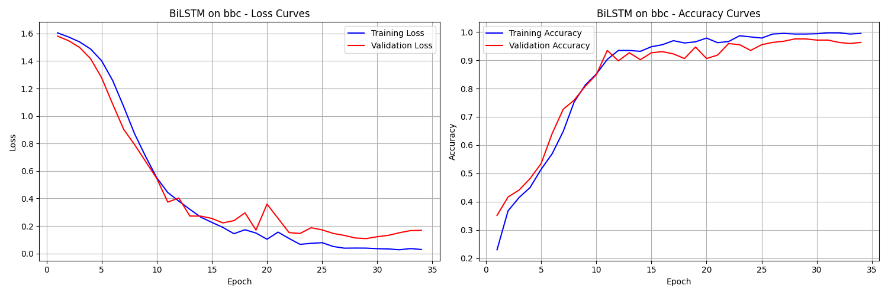
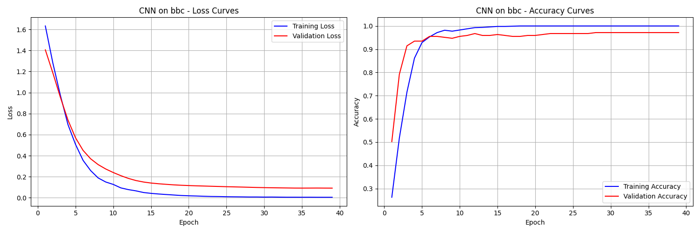
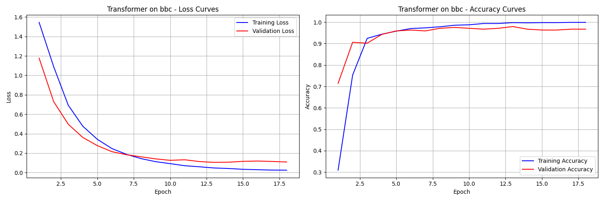
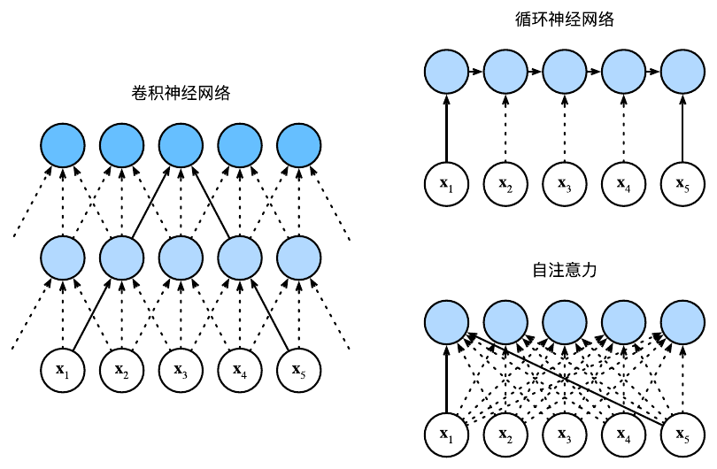
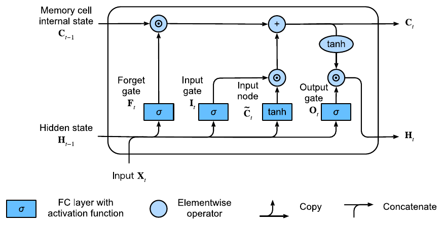
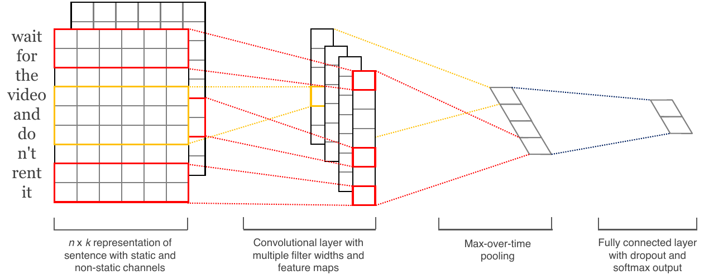
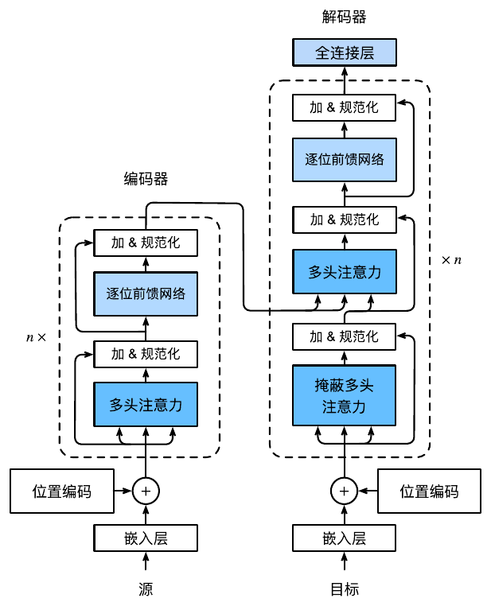

# LSTM、CNN 与 Transformer 的原理及其在文本分类任务上的性能比较

[English](README.md) | **简体中文**

> 在统一、公平的训练协议下，对 **BiLSTM**、**CNN**、**Transformer** 三类编码器在四个文本
> 分类基准上的可复现对比研究；并配有一份从原理出发的理论讲稿（LSTM 前向/反向推导、CNN、
> 注意力机制、位置编码、计算复杂度分析）。

本仓库包含两部分：

- **`Code/`** —— 简洁的 PyTorch 实现（数据流水线、三个模型、统一训练器）以及真实的实验产物（指标 CSV 与训练曲线）。
- **`Beamer/`** —— 配套的「理论 + 结果」讲稿（LaTeX/Beamer 源码与已编译 PDF）。

---

## 目录

- [核心结果](#核心结果)
- [对比对象](#对比对象)
- [仓库结构](#仓库结构)
- [数据集](#数据集)
- [环境配置](#环境配置)
- [使用方法](#使用方法)
- [方法：统一训练协议](#方法统一训练协议)
- [模型结构](#模型结构)
- [输出产物](#输出产物)
- [结论](#结论)
- [讲稿 / 报告](#讲稿--报告)
- [说明与局限](#说明与局限)

---

## 核心结果

**测试准确率**（单次运行，随机种子 42；**加粗** = 该列最优）：

| 模型        | IMDB      | AG News   | BBC News  | SST-5     |
|-------------|-----------|-----------|-----------|-----------|
| BiLSTM      | 87.3%     | **92.3%** | 94.8%     | 41.9%     |
| CNN         | **88.5%** | 92.2%     | **97.3%** | **42.4%** |
| Transformer | 88.1%     | 92.1%     | 96.3%     | **42.4%** |

**推理吞吐量**（samples/s，批大小 512，纯前向，RTX 5090）：

| 模型        | IMDB (n≤400) | AG News (n≤64) | BBC News (n≤512) | SST-5 (n≤64) |
|-------------|--------------|----------------|------------------|--------------|
| BiLSTM      | 34,221       | 171,914        | 27,262           | 182,300      |
| CNN         | **51,636**   | **342,039**    | **40,910**       | **325,482**  |
| Transformer | 27,633       | 300,090        | 19,726           | 287,941      |

各模型完整指标（准确率、加权精确率/召回率/F1、损失、计时）见
[`Code/results/<dataset>/metrics/`](Code/results)。

<details>
<summary><b>训练曲线</b>（以 BBC News 为例 —— 点击展开）</summary>

<p align="center">
  <br>
  <br>
  
</p>

在仅 980 条训练样本的 BBC 上，三模型训练准确率均接近 100%，但 BiLSTM 泛化最差（测试 94.8%）
—— 直观体现其较低的样本效率。全部数据集的曲线见 [`Code/results/<dataset>/plots/`](Code/results)。
</details>

---

## 对比对象

三类编码器均以同一套（默认可微调的）GloVe-300d 词向量为输入，并采用**相同**的优化器、
学习率调度、早停规则、批大小与随机种子——因此性能差异反映的是**归纳偏置 × 任务契合度**，
而非调参运气：

- **BiLSTM** —— 双向循环编码器（顺序建模）。
- **CNN** —— 多尺度一维卷积（局部 *n*-gram 特征）。
- **Transformer** —— 仅编码器的自注意力（全局依赖）。

<p align="center">
  <br>
  <sub>三类编码器连接各位置的方式 —— CNN（局部）、RNN（顺序）、自注意力（全局）。</sub>
</p>

---

## 仓库结构

```
.
├── README.md                 # 英文（默认）
├── README.zh-CN.md           # 本文件（中文）
├── Code/                      # 实现 + 实验产物
│   ├── README.md             # 代码级使用说明
│   ├── pyproject.toml        # 依赖（由 uv 管理）
│   ├── src/
│   │   ├── config.py         # 数据集 / 训练 / 模型配置
│   │   ├── training.py       # 共享数据流水线 + 训练循环
│   │   ├── train_all.py      # 命令行入口（多模型，输出对比 CSV）
│   │   ├── train_{bilstm,cnn,transformer}.py
│   │   ├── data/             # HF 加载、预处理、GloVe 词向量
│   │   ├── models/           # base、bilstm、cnn、transformer
│   │   └── utils/            # trainer（训练/评估）、metrics + 绘图
│   └── results/<dataset>/    # 指标 CSV 与训练曲线 PNG
└── Beamer/                    # 理论 + 结果讲稿
    ├── 文本分类.tex          # LaTeX/Beamer 源码
    └── 文本分类.pdf          # 已编译幻灯片
```

---

## 数据集

首次运行时从 Hugging Face Hub 自动下载。

| 键名      | Hub 数据集         | 类别数 | 截断长度 | 任务 / 特点              |
|-----------|--------------------|--------|----------|--------------------------|
| `imdb`    | `stanfordnlp/imdb` | 2      | 400      | 情感分类，长影评         |
| `ag_news` | `fancyzhx/ag_news` | 4      | 64       | 主题分类，短新闻、大规模 |
| `bbc`     | `SetFit/bbc-news`  | 5      | 512      | 主题分类，长文档、小样本 |
| `sst5`    | `SetFit/sst5`      | 5      | 64       | 细粒度情感，高难度       |

四个数据集在**数据规模**（约 1k–12 万）、**文本长度**（句子级 → 长文档）、**任务难度**
（二分类 → 五级细粒度）三个维度上互补，便于归因架构差异。

---

## 环境配置

需要 [uv](https://docs.astral.sh/uv/)（Python 3.11）。

```bash
cd Code
uv sync
```

首次运行时会自动下载数据集（Hugging Face Hub）与 GloVe 词向量
（`glove.6B.300d`，约 800 MB 压缩包 → `Code/pre-trained/`）。

---

## 使用方法

```bash
cd Code

# 在某个数据集上训练全部三个模型
uv run python src/train_all.py --model all --dataset imdb

# 仅训练单个模型
uv run python src/train_all.py --model cnn --dataset ag_news

# 依次跑完所有数据集
uv run python src/train_all.py --model all --dataset all

# 指定运行设备
uv run python src/train_all.py --model all --dataset imdb --device cpu
```

每次运行会先清空该数据集的旧产物，并写入不含时间戳的最新结果，因此每个
`results/<dataset>/` 目录始终只保留一份（最新）结果。超参数定义在
`src/config.py` 的 `TRAIN_CONFIG` / `MODEL_CONFIGS` 中。更多细节见
[`Code/README.md`](Code/README.md)。

---

## 方法：统一训练协议

三个模型完全一致，以保证比较公平：

- **词向量：** GloVe-6B-300d，参与训练（微调）；未命中词随机初始化。
- **优化器：** AdamW（η = 1e-3，权重衰减 λ = 0.01）+ 梯度裁剪（max-norm 1.0）。
- **学习率调度：** `ReduceLROnPlateau`（验证损失 2 轮无改善则学习率减半）。
- **早停：** 验证损失连续 5 轮改善不足 1e-3 即停止（上限 50 轮），回溯最优验证损失对应的权重。
- **数据：** 分层切分训练/验证集（10%；BBC 因样本极少取 20%）；词表仅由训练子集构建；**测试集仅在训练结束后评估一次**。
- **损失：** 作用于 logits 的交叉熵。**批大小：** 512。**随机种子：** 42。
- **预处理：** 小写化 → 去除 HTML/URL/非字母字符 → 分词 → 过滤停用词（豁免 *not/no/don* 等否定词以保留情感信号）与单字符词。

---

## 模型结构

| 模型 | 关键配置 | 序列汇聚方式 |
|------|----------|--------------|
| **BiLSTM** | 2 层、隐藏维 128、双向、dropout 0.5 | 拼接最后一层前向 + 后向的最终隐状态 |
| **CNN** | 100 个卷积核、尺寸 [2,3,4]、dropout 0.5；**残差块**（因 300→100 通道不匹配，捷径用 1×1 卷积）+ 池化后批归一化 | 时间最大池化 |
| **Transformer** | 仅编码器、d_model 128、4 头、FFN 256、2 层、dropout 0.1；**Pre-LN** + 末端 LayerNorm、正弦位置编码、padding mask | 掩蔽平均池化，再接三层 MLP 分类头 |

非嵌入参数量：BiLSTM ≈ 83.6 万 > CNN ≈ 45.2 万 > Transformer ≈ 37.1 万
（嵌入层三者相同：词表 × 300）。

<p align="center"><br><sub>LSTM 单元 —— 遗忘门 / 输入门 / 输出门，沿加性细胞状态通道演化。</sub></p>
<p align="center"><br><sub>文本 CNN —— 多尺度卷积 + 时间最大池化（Kim, 2014）。</sub></p>
<p align="center"><br><sub>Transformer 编码器–解码器；本工作仅使用<b>编码器</b>。</sub></p>
<p align="center"><sub>架构图改编自《<a href="https://zh.d2l.ai">动手学深度学习</a>》(d2l.ai) 与 Kim (2014)。</sub></p>

---

## 输出产物

```
Code/results/<dataset>/
├── metrics/   <Model>_<dataset>_best_metrics.csv   # 各模型 训练/验证/测试 指标
│              comparison_<dataset>.csv             # 三模型并排对比
└── plots/     <Model>_<dataset>_training_curves.png # 损失与准确率曲线
Code/models/saved/<dataset>/                          # 最优检查点（已在 .gitignore 中忽略）
```

---

## 结论

- **CNN 最为稳健** —— 在多数数据集上取得最佳或并列最佳，且**推理吞吐始终最高**；局部 *n*-gram 特征与关键词/情感短语驱动的分类任务高度契合。
- **Transformer 随有效上下文增加而提升** —— 在长文本任务（IMDB、BBC）上接近 CNN，但自注意力的 O(n²) 开销使其在长序列上吞吐最低；在小规模、无预训练的设定下未触及其全局建模的上限。
- **BiLSTM 在小样本场景最弱** —— 在仅 980 条训练样本的 BBC 上过拟合最重、泛化最差，顺序计算也限制其吞吐；当数据充足时（AG News）则与并行架构持平。
- **任务性质决定差距大小** —— 在 AG News 与 SST-5 上，三模型差距均小于统计噪声（标准误 ±0.3%、±1.1%），应视为无显著差异：前者过易（关键词可分），后者过难（五级细粒度）。
- **参数量不预示性能** —— 参数最多的 BiLSTM 仅在统计平局的 AG News 上名义居首、在其余三个数据集上均垫底；差异源于归纳偏置与任务的契合度，而非模型容量。

---

## 讲稿 / 报告

完整的「理论 + 结果」讲稿见 [`Beamer/文本分类.pdf`](Beamer/文本分类.pdf)：包含 LSTM/Peephole 的
前向与反向传播推导、CNN、注意力机制与 Transformer、位置编码、各层计算复杂度分析，以及上述
实验。重新编译请使用 `xelatex`（参考文献使用 `biber`）。

---

## 说明与局限

- 单一随机种子 + 统一配置（未做逐模型网格搜索）：结论应理解为**同一协议下的公平相对比较**，而非各模型调优后的性能上限。
- 精确率/召回率/F1 均为按类别支持度**加权**的平均（scikit-learn `average='weighted'`）。
- 推理吞吐为纯前向墙钟时间（CUDA 同步计时、不含数据加载），在 RTX 5090 上以批大小 512 测得。

---

## 许可证

本项目基于 [MIT 许可证](LICENSE) 发布。
